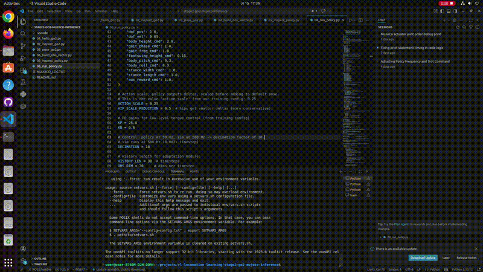
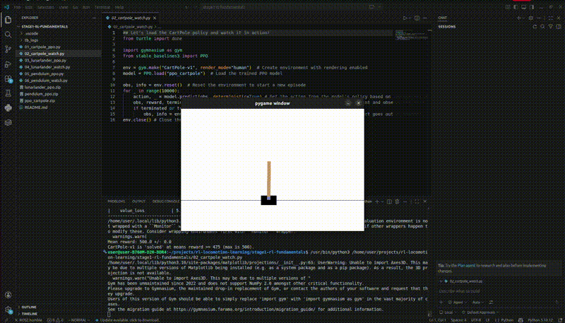
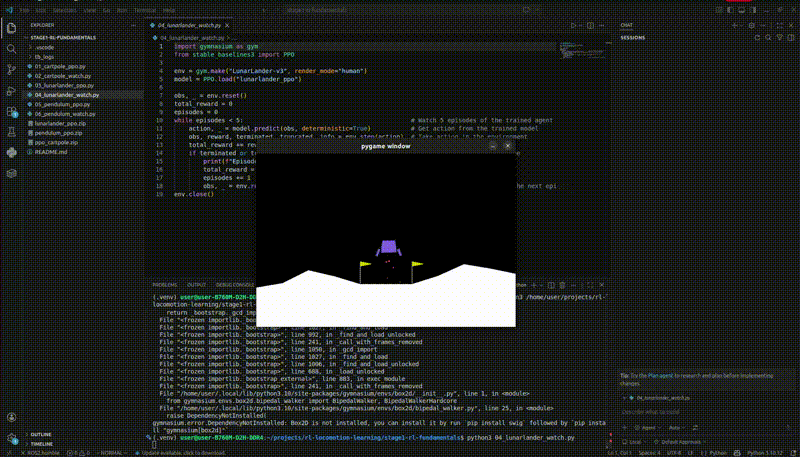
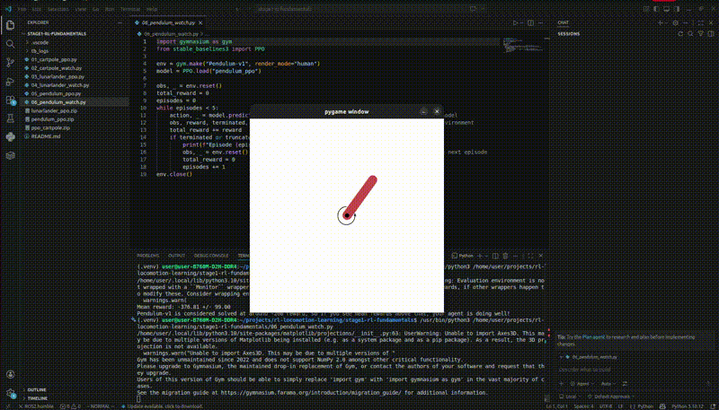

# Quadruped Locomotion via Reinforcement Learning

End-to-end research project on reinforcement learning for legged robot locomotion, with a focus on the Unitree Go2 quadruped platform. Covers RL algorithm fundamentals, simulation infrastructure, policy deployment, and a planned trajectory toward vision-conditioned and hardware-deployable controllers.

> **Current milestone:** Pretrained `walk-these-ways` policy successfully deployed on the Unitree Go2 in MuJoCo. Robot achieves sustained forward locomotion at 0.227 ± 0.005 m/s when commanded 0.5 m/s (measured, n=5).
> **Active work:** Custom policy training on free-tier GPU infrastructure.
> **Platform constraint:** Developed on CPU-only hardware; GPU usage limited to bursty training sessions on cloud platforms.

---

---

## Project Scope

Reinforcement learning has matured into the dominant approach for legged-robot locomotion control, with frameworks like `walk-these-ways` (MIT Improbable AI Lab) demonstrating that gait-conditioned policies trained entirely in simulation can transfer to physical hardware. This project rebuilds, deploys, and extends that body of work for the Unitree Go2 platform, with three primary objectives:

1. **Establish a reproducible CPU-friendly deployment pipeline** for pretrained legged-robot policies in MuJoCo, suitable for development environments without dedicated GPU hardware.
2. **Train custom locomotion policies** under bursty-GPU constraints using modern parallel simulators (MJX, `mujoco_playground`).
3. **Extend toward vision-conditioned locomotion** and hardware deployment for terrain-aware, autonomous operation.

The methodology emphasizes principled engineering — reading source code over relying on documentation, verifying assumptions against training configurations, and isolating sim-to-sim transfer issues systematically.

---

## Current Results

### Pretrained Policy Deployment (MuJoCo)

The `walk-these-ways` policy — originally trained in Isaac Gym on a GPU cluster — has been deployed on the Unitree Go2 MJCF (from `mujoco_menagerie`) running entirely on CPU.

All figures below are measured by the experiment harness over **5 seeded trials**
(3 s settle + 30 s measurement window) and are reproducible from the committed
raw data in [`experiments/results/exp1_velocity_sweep.csv`](./stage2-go2-mujoco-inference/experiments/results/exp1_velocity_sweep.csv).

| Metric | Value | Source |
|---|---|---|
| Sustained forward velocity | **0.227 ± 0.005 m/s** (commanded 0.5 m/s) | Exp 1, n=5 |
| Velocity tracking error | 0.273 ± 0.005 m/s | Exp 1, n=5 |
| Body height | 0.2785 m, std 0.0060 m | Exp 1, n=5 |
| Survival rate | 100% at every commanded velocity (0.0–1.5 m/s) | Exp 1, 30 trials |
| Peak achieved velocity | 0.574 m/s (saturates; commanding 1.5 yields 0.558) | Exp 1 |
| Control frequency | Policy 50 Hz, simulation 500 Hz, decimation 10 | source |
| Inference latency | <2 ms per policy step (CPU) | timed during development |

> **Note on an earlier figure.** Previous revisions of this README reported
> ~0.28 m/s. That number predates the experiment harness — it came from a
> single interactive run of `06_run_policy.py`, with no settle window, no
> seeded initial conditions and no averaging across trials. The harness figure
> of 0.227 ± 0.005 m/s supersedes it. The qualitative claim is unchanged and is
> in fact the project's central finding: **the policy achieves only 37–55% of
> commanded velocity after Isaac Gym → MuJoCo transfer.**

### Sim-to-Sim Transfer Findings

Migrating a policy trained in Isaac Gym to MuJoCo surfaced several non-trivial mismatches. The principled fixes from this work are documented in [`stage2-go2-mujoco-inference/`](./stage2-go2-mujoco-inference/) and summarized below:

| Issue | Resolution |
|---|---|
| Control frequency mismatch | Decimation tuned to match the policy's 50 Hz training frequency |
| Gait clock signal misinterpretation | Per-foot phase sines reconstructed from training source code |
| MJCF default pose ≠ training default pose | Joint initialization overridden to match training configuration |
| Hip sign convention inversion | Joint angle signs corrected against training config dump |

---

## Project Components

### Component 1 — RL Algorithm Foundation

Implementation and analysis of Proximal Policy Optimization (PPO) on standard Gymnasium benchmarks. Establishes the algorithmic baseline used throughout subsequent work and a working understanding of training dynamics, hyperparameter sensitivity, and convergence diagnostics.

📁 [`stage1-rl-fundamentals/`](./stage1-rl-fundamentals/)

**CartPole-v1 — discrete control baseline**

> 4-dim observation, 2-dim discrete action, dense reward. Establishes the train-evaluate loop and policy/value network roles.

| Result | ~500 / 500 (max) |
|--|--|
| Timesteps | 100,000 (`01_cartpole_ppo.py`) |
| Compute | ~2 min, CPU |



**LunarLander-v3 — shaped-reward control**

> 8-dim observation, 4-dim discrete action, multi-component shaped reward. Introduces reward-engineering tradeoffs.

| Result | 220–274 (solved threshold 200) |
|--|--|
| Timesteps | 1,000,000 trained; peak ~700k–800k before policy collapse |
| Compute | ~15 min, CPU |



**Pendulum-v1 — continuous control**

> 3-dim observation, 1-dim continuous action, Gaussian policy. Continuous action spaces are the algorithmic prerequisite for joint-level robot control.

| Result | ≥ −200 (solved threshold −200) |
|--|--|
| Timesteps | 300,000 — the sweet spot; more added nothing |
| Compute | ~10 min, CPU |



---

### Component 2 — Go2 Policy Deployment in MuJoCo

Full inference pipeline from MuJoCo state → 70-dim observation vector → adaptation module → policy network → joint targets → PD-controlled torques. Implements the architecture of Rapid Motor Adaptation (RMA) deployment as used by `walk-these-ways`.

📁 [`stage2-go2-mujoco-inference/`](./stage2-go2-mujoco-inference/)

| Sub-task | Outcome |
|---|---|
| **2.1** — Load Go2 MJCF, verify viewer | Robot loads and renders correctly |
| **2.2** — Inspect model structure | 19 qpos, 18 qvel, 12 actuators enumerated |
| **2.3** — Manual PD pose holding | Stable standing pose under gravity |
| **2.4** — Build 70-dim observation vector | Each field traced to training source code |
| **2.5** — Load policy, run inference | Robot walks (see Current Results above) |

---

## Tech Stack

| Tool | Version | Role |
|---|---|---|
| Python | 3.10+ (3.12 verified) | Implementation |
| Stable-Baselines3 | 2.4+ | PPO for Stage 1 and Stage 3 |
| Gymnasium | 1.0+ | RL environment API (`LunarLander-v3` needs ≥ 1.0) |
| MuJoCo | 3.2+ | Physics simulation |
| PyTorch | 2.4+ (CPU build) | Policy inference, training, TorchScript export |
| TensorBoard | 2.16+ | Training diagnostics |
| pytest | 8+ | Contract test suite |
| Docker | Compose v2 | Reproducible environment |
| MJX / mujoco_playground | optional | GPU scale-up path for Stage 3 |

Exact pins in [`requirements.txt`](./requirements.txt); run `./scripts/setup_env.sh` to install.

---

## Stage Planning & Status

| Stage | Plan | Description | Status |
|---|---|---|---|
| **Stage 1** | RL fundamentals | Implement PPO on CartPole, LunarLander, and Pendulum to establish the algorithmic baseline. Build training-curve diagnostics intuition before applying RL to robotic control. | ✅ Complete |
| **Stage 2** | Go2 inference in MuJoCo | Deploy the pretrained `walk-these-ways` policy on the Unitree Go2 in MuJoCo. Implement the full inference pipeline: observation construction, history buffer, adaptation module, dual-rate PD control. | ✅ Complete |
| **Stage 3** | Custom Go2 policy training | Full training stack implemented and verified end to end: contract-compliant environment, 12 reward terms, terrain curriculum derived from Experiment 3's measured failure boundaries, 8-parameter domain randomization, PPO + RMA two-phase training, checkpoint/resume, and TorchScript export that Stage 2's harness evaluates unmodified. 📁 [`stage3-go2-training/`](./stage3-go2-training/) | ⚙️ Pipeline complete — awaiting GPU compute for a converged policy |
| **Stage 4** | Vision-conditioned locomotion | Integrate depth-camera input into the policy's observation space for terrain-aware locomotion (stairs, gaps, slopes). Extends from blind proprioceptive control to perceptive control. | ⏳ Planned |
| **Stage 5** | ROS2 deployment infrastructure | Wrap the trained policy as a ROS2 node compatible with Unitree SDK2 deployment requirements. Establish the software interface required for hardware testing. | ⏳ Planned |
| **Stage 6** | Sim-to-real validation | Quantify the sim-to-real gap on the physical Go2 platform (subject to hardware availability). Document failure modes and iterate on domain randomization parameters. | 🔮 Future |

---

## Repository Structure

```
rl-locomotion-learning/
├── reinforcement-learning-theories/   8 chapters: RL foundations → PPO →
│                                      legged locomotion → this project
├── stage1-rl-fundamentals/            PPO on CartPole / LunarLander / Pendulum
│   └── 01-06_*.py                     odd = train + save, even = load + watch
│
├── stage2-go2-mujoco-inference/       The core of the project
│   ├── paths.py                       env-overridable path resolution
│   ├── 01-08_*.py                     numbered curriculum; 06 = the robot walks
│   ├── scenes/                        self-contained Go2 MJCF + 11 terrain worlds
│   ├── experiments/                   harness + 3 studies + figure pipeline
│   │   ├── harness.py                 headless run_trial() — the shared backbone
│   │   ├── exp1/exp2/exp3_*.py        velocity, gait, terrain sweeps
│   │   └── results/                   CSVs + EXPERIMENT_FINDINGS.md
│   └── paper_figures/                 curated figures for the write-up
│
├── stage3-go2-training/               Custom policy training (contract-compliant)
│   ├── networks.py                    the contract + RMA architecture
│   ├── train.py                       PPO (phase 1) + distillation (phase 2)
│   ├── export.py                      checkpoint → TorchScript, 4-way verified
│   ├── evaluate.py                    exported policy vs baseline, via harness
│   └── env/                           env, rewards, curriculum, domain rand
│
├── tests/                             93 tests; none need policy weights
├── docs/                              architecture, SRS, TDD, features, setup
├── scripts/                           setup_env.sh, check_env.py
├── docker/                            Dockerfile + 4 compose services
├── policies/                          walk-these-ways checkpoints (not committed)
└── media/                             demo GIFs
```

---

## Getting Started

```bash
git clone <repo> && cd rl-locomotion-learning
./scripts/setup_env.sh          # detects your OS, installs everything, verifies
source .venv/bin/activate
make help                       # see every available target
make test                       # 91 tests, no policy weights needed
```

Or run it containerised, with no host dependencies beyond Docker:

```bash
docker compose -f docker/compose.yaml build
docker compose -f docker/compose.yaml run --rm lab
```

> **Note on the policy weights.** The pretrained `walk-these-ways` checkpoints
> are a large external *input* to this project and are not committed. Stage 2
> inference needs them; see [docs/DEPENDENCIES.md](docs/DEPENDENCIES.md#6-the-one-dependency-we-cannot-install).
> Everything else — all of Stage 1, Stage 2 scripts 01–04, scene generation, and
> the complete figure pipeline — runs without them.

### Documentation

| Document | Read when |
|---|---|
| [docs/README.md](docs/README.md) | starting out — includes a day-one reading order |
| [docs/ARCHITECTURE.md](docs/ARCHITECTURE.md) | you want the system view, with diagrams |
| [docs/TECH-STACK-PRIMER.md](docs/TECH-STACK-PRIMER.md) | MuJoCo / PyTorch / Gymnasium are new to you |
| [docs/DEPENDENCIES.md](docs/DEPENDENCIES.md) | setting up, or something will not install |
| [docs/DOCKER.md](docs/DOCKER.md) | running in a container |
| [docs/SRS.md](docs/SRS.md) · [docs/TDD.md](docs/TDD.md) | requirements and design rationale |
| [docs/FEATURES.md](docs/FEATURES.md) | what is implemented vs planned |
| [docs/REVERSE-ENGINEERING.md](docs/REVERSE-ENGINEERING.md) | known issues and good first tasks |
| [docs/AGENTIC-WORKFLOW.md](docs/AGENTIC-WORKFLOW.md) | working on this repo with AI coding tools |
